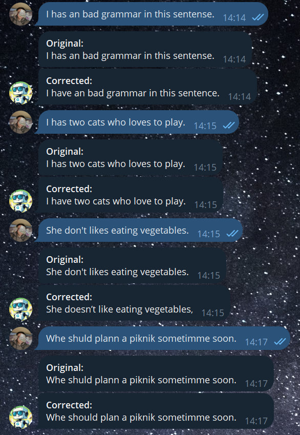
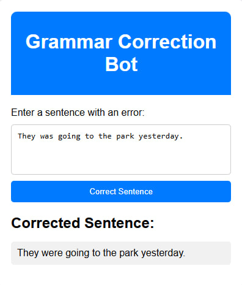

# Grammar Fix Bot

Grammar Fix Bot is a robust project designed to enhance English grammar correction capabilities. It includes tools for generating error-ridden training datasets, fine-tuning transformer models, and providing real-time grammar correction via a messenger bot and app.

## Features

- **Data Preparation**: Utilizes a JavaScript script to scrape sentences from downloaded books and generate error-prone versions using the Google Bard API.
- **Model Fine-Tuning**: Fine-tunes a pre-trained transformer model from Hugging Face on a curated dataset for optimal grammar correction performance. The model used for fine-tuning can be found [here](https://huggingface.co/pszemraj/grammar-synthesis-small).
- **Real-Time Correction**: Delivers seamless grammar correction through a user-friendly messenger bot and app interface.

## Example Photos

Here are some example photos showing how the Telegram bot and app work:

<p align="center">
    
    
</p>

## Running the Flask App Locally

To run the Flask app on your local machine, follow these steps:

1. Clone the repository:

   ```bash
   git clone https://github.com/davydantoniuk/grammarfix-bot.git
   cd grammarfix-bot
   ```

2. Create a virtual environment and activate it:

   ```bash
   python -m venv venv
   source venv/bin/activate  # On Windows use `venv\Scripts\activate`
   ```

3. Install the required dependencies:

   ```bash
   pip install -r requirements.txt
   ```

4. Run the Flask app:

   ```bash
   cd app
   python app.py
   ```

5. Open your browser and navigate to `http://127.0.0.1:5000` to see the app in action.
